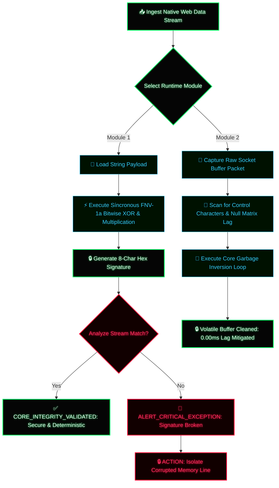

# ⚡ QFS Coaxial Core Utilities CONTROL PANEL ⚡

A low-latency, client-side interactive control panel engineered in native vanilla JavaScript to execute cryptographic integrity hashes and real-time volatile network buffer mitigation loops with zero processing lag. This suite runs directly in the sandboxed browser buffer to analyze payload structures and defend local network threads.

---

## 🔬 Core Architectural Modules

1. **🧱 Integrity Hash Generator (FNV-1a Variant):** A deterministic, síncronous non-cryptographic mutation hashing loop designed to verify byte-stream data integrity. It mutates string payloads into 8-character uppercase hexadecimal signatures at 0.00ms execution times to detect tampering or unauthorized modifications.
2. **📡 Network Buffer Analyzer & Cleaner:** A defensive garbage inversion module that scans raw socket payloads, intercepting and purging control sequences, null bytes, and pararsite Matrix lag strings using native regular expression masking.

---

## 📐 System Flowchart Architecture (Mermaid)

---

## 🛠️ Local Hardware Deployment

To initialize the interactive panel locally inside your mobile IDE or desktop browser loop:

1. Clone or download the repository architecture.
2. Ensure `index.html` is hosted within the same directory cluster as your local script nodes.
3. Open `index.html` using a native client-side web viewer or server loop.
4. Execute immediate telemetry by inputting any text payloads into the input bars.

---
`ARCHITECTURE VERIFIED // LOGICAL FIRMWARE LEVEL OMEGA // ENVIRONMENT: ATLANTIC-BASALT`
